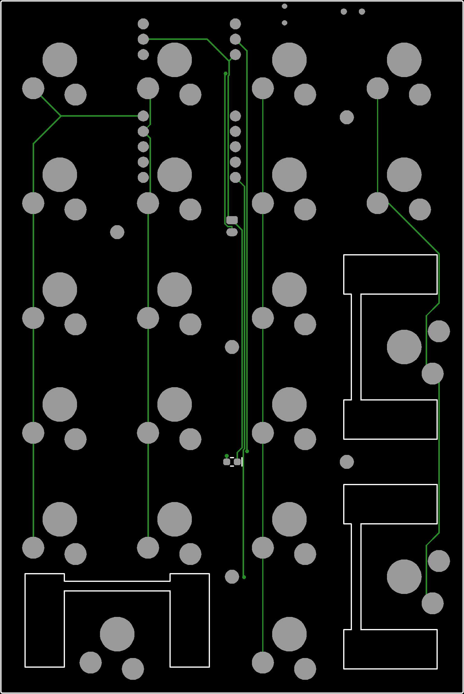

# Low-profile wireless numpad

A 21-key low-profile numpad: 4 columns × 6 rows, with three 2u keys ("0", "+", "Enter").

- **Controller:** nice!nano v2, running ZMK over Bluetooth.
- **Switches:** Gateron KS-33 low-profile switches in hotswap sockets.
- **Battery:** a 301230 LiPo with a low-battery LED.
- **Case:** a tilted 3D-printed case with a separate switch plate.

It's based on ceoloide's "not about money" ergogen design. The PCB is generated with
[ergogen](https://ergogen.xyz), routed with freerouting, and checked in KiCad 8. The case is generated
from the board itself, so the two always match.



## Status

| Piece | State |
|---|---|
| PCB | Routed and DRC-clean. Gerbers are ready in `kicad/fab/numpad-gerbers.zip` (a PCBWay-ready package is `kicad/numpad.kicad_pcb.zip`). |
| Case and plate | `case/case_bottom.stl`, `case/case_plate.stl` |
| Firmware | Not written yet. ZMK needs a board definition using the pin map below. |

Before printing the whole plate, **test-print one stabilizer cutout**. Its notch depth and neck size come from a
drawing that isn't to scale.

## Shopping list

See **[SHOPPING_LIST.md](SHOPPING_LIST.md)**.

## Repository layout

| Path | What it is |
|---|---|
| `config.yaml` | Ergogen source of truth for the PCB: layout, footprints, outline. |
| `footprints/ceoloide/` | Upstream ceoloide footprints. |
| `footprints/custom/` | Local footprints. `mcu_nice_nano_sparse.js` adds an `omit_pins` option; `smd_0603.js` is for the LED and resistor. |
| `output/` | **Current board.** `pcbs/not_about_money.kicad_pcb` is routed (DRC report `pcbs/drc.rpt`, preview `routed.svg`); `not_about_money.unrouted.kicad_pcb` is the raw ergogen output. |
| `kicad/` | KiCad project for the current board (with the project's 0.2 mm edge-clearance rule), `fab/` (gerbers + drill + zip), and the PCBWay package `numpad.kicad_pcb.zip`. |
| `case/build_case.py` | Generates the case from the board: `case_bottom.jscad`, `case_plate.jscad`, `assembly.json`. |
| `case/viewer.html` | 3D viewer of the case, plate, PCB, parts, keycaps and battery. |
| `case/battery_fit.py` | Finds where LiPo cells fit under the tilted PCB. |
| Git history | Earlier design iterations (commit `c19e498` has every old `output_*` folder and config backup). |
| `CLAUDE.md` | Detailed design notes: coordinates, measurements, decisions, gotchas. |

## 1. Order the PCB

Upload `kicad/fab/numpad-gerbers.zip` to any PCB fab. For PCBWay, `kicad/numpad.kicad_pcb.zip` already includes their BOM, netlist and positions files. Order a 2-layer, 1.6 mm, standard-spec board. The
design values (0.25 mm tracks, 0.2 mm clearance, 0.6/0.3 mm vias) are within every fab's limits. The three
stabilizer cutouts are part of the board outline.

## 2. Print the case

- **`case/case_bottom.stl`:** print as-is (floor down). It has a 0.5 mm battery pocket in the floor and three
  windows in the back wall: USB-C, reset, and the power-switch lever. The USB-C port sits at the back of a
  12.5 × 6.5 mm recess so a cable head can reach it; the recess's back wall is flush with the port.
- **`case/case_plate.stl`:** print **upside down** (plate top on the bed). The edge rim and the spacer posts
  around the screws are on its underside.
- **Settings:** PLA or PETG, 0.2 mm layers. No supports needed.

## 3. Assemble

The switches go on the front of the PCB. **Everything else** goes on the back (side B), except the
low-battery LED, which is on the front.

1. **Trim three sockets.** On the hotswap sockets for the three 2u keys ("0", "+", "Enter"), sand
   **1.1 mm off the tip of the solder tab that points at the stabilizer cutout**, leaving about 1.4–1.5 mm of
   tab. Without this, that tab hits the stabilizer housing. Dry-fit each socket to find the right tab, then
   clean and tin it.
2. **Back side SMD parts:** solder the 21 diodes (mind the cathode band), the 21 hotswap sockets, the reset
   button, the power switch, and the 1 kΩ resistor.
3. **Front side:** solder the 0603 LED. It sits under a hole in the plate between the keycaps.
4. **Battery connector:** solder the JST PH on the back, then **trim its pins flush** on the front. They're
   3.4 mm long and the plate only leaves 1.6 mm above the PCB.
5. **nice!nano:** the controller mounts on the back, components facing **away** from the PCB, on standard
   male header pins with 2.5 mm plastic spacers.
   - Fit pins **only** where the PCB has holes: 16 pins (RAW, RST, GND ×2, P0, P1, P4–P8, P14–P16, P18,
     P19). The other 8 positions sit over switch pads and are left off on purpose.
   - Trim the pins on the front to about 1.4 mm.
6. **Battery:**
   - **Check polarity first.** On the JST footprint, the oval pad (pad 2) is **battery +** and the
     squarer pad (pad 1) is **battery −**. Many cheap LiPos have their plug wired the other way round.
     Measure with a multimeter before plugging in.
   - Stick the 301230 into the floor pocket with thin double-sided tape. Its lead runs from the notch at the
     pocket's end to the JST.
7. **Plate, stabilizers and switches:**
   - Clip the stabilizers into the plate. The wire bar faces the middle of the board.
   - Press the switches into the plate.
   - Lower the plate onto the PCB so the switch pins enter the sockets.
8. **Into the case:** angle the PCB in at the back first and slide it back, so the power lever slips
   through its window (it pokes about 0.5 mm out of the back) and the USB-C port slides into its window
   (it sits inside the wall, so it can't drop in from above). Then drop
   the front onto the pillars.
9. **Screws:** fit the countersunk M2 screws through the plate. Use **M2×8** at the back-left, back-right and
   centre pillars, and **M2×6** at the two front pillars. Tighten gently; they cut their own thread in the
   plastic.
10. **Keycaps.**

## 4. Firmware (ZMK)

The matrix is 4 columns × 6 rows, with diodes oriented column → row. The pin map below differs from the
original design, so the ZMK board/shield definition must match:

| Signal | nice!nano pin |
|---|---|
| Columns C1–C4 | P19, P18, P15, P14 |
| Row R1 | P16 |
| Rows R2–R6 | P4, P5, P6, P7, P8 |
| Low-battery LED (active high) | P0 (nRF P0.08) |
| Free spare | P1 |

VCC (3.3 V out) isn't connected. ZMK has no built-in low-battery LED, so blinking P0 when the battery is low
needs a small custom module. Keep it to a blink, because a steady LED drains the battery.

## Rebuilding from source

Requires ergogen v4.1.0 (`npm i -g ergogen@4.1.0`), KiCad 8 (its bundled Python provides `pcbnew`), and Java
15+ for freerouting 1.4.5.1.

1. **Generate the PCB.** Custom footprints only load when ergogen gets a *directory*. Copy `config.yaml` and
   `footprints/` into a scratch folder, then run:
   ```bash
   ergogen <scratch-folder> -o <scratch-folder>/out --clean
   ```
   Then copy `out/pcbs`, `out/outlines` and `out/cases` over the ones in `output/`. Don't point ergogen
   at `output/` directly: `--clean` empties the whole folder, including the routed board.
2. **Route it.** Export a Specctra DSN with `pcbnew.ExportSpecctraDSN`, then route:
   ```bash
   java -jar freerouting-1.4.5.1.jar -de board.dsn -do board.ses -mp 30
   ```
   Import the result with `pcbnew.ImportSpecctraSES`. Set copper-to-edge clearance to 0.2 mm (the side
   switches sit at the board edge), then run DRC:
   ```bash
   kicad-cli pcb drc --severity-error board.kicad_pcb
   ```
3. **Gerbers:**
   ```bash
   kicad-cli pcb export gerbers --output fab/ board.kicad_pcb
   ```
   ```bash
   kicad-cli pcb export drill --output fab/ board.kicad_pcb
   ```
   Then zip the `fab/` folder.
4. **Case.** Point `BOARD` at the top of `case/build_case.py` to the board, then run it with KiCad's Python. It
   prints the stack-up, a collision report, the battery spot and the screw lengths.
   ```bash
   "C:/Program Files/KiCad/8.0/bin/python.exe" case/build_case.py
   ```
   Render the jscad files to STL with the **v1** JSCAD CLI (v2 can't run them):
   ```bash
   npm install --prefix .jscad @jscad/cli@1
   ```
   ```bash
   .jscad/node_modules/.bin/openjscad case/case_bottom.jscad -o case/case_bottom.stl
   ```
   ```bash
   .jscad/node_modules/.bin/openjscad case/case_plate.jscad -o case/case_plate.stl
   ```
5. **View it.** Serve the case folder and open `http://localhost:8765/viewer.html`:
   ```bash
   python -m http.server 8765 --directory case
   ```

`CLAUDE.md` has the full design notes: the tilt and stack-up, where each part dimension came from (datasheet
vs estimate), the stabilizer geometry, and the controller pin constraints.

## Credits and licenses

- The base design and most footprints are by [ceoloide](https://github.com/ceoloide), with contributions by
  @infused-kim and @nxtk; see `footprints/ceoloide/LICENSE`.
- Some footprints are **CC BY-NC-SA 4.0**: the nice!nano and power-switch footprints, and therefore
  `footprints/custom/mcu_nice_nano_sparse.js`, which is derived from one of them. Others are MIT. Check the
  header of each file.
- The non-commercial clause means boards built from this repo shouldn't be sold.
